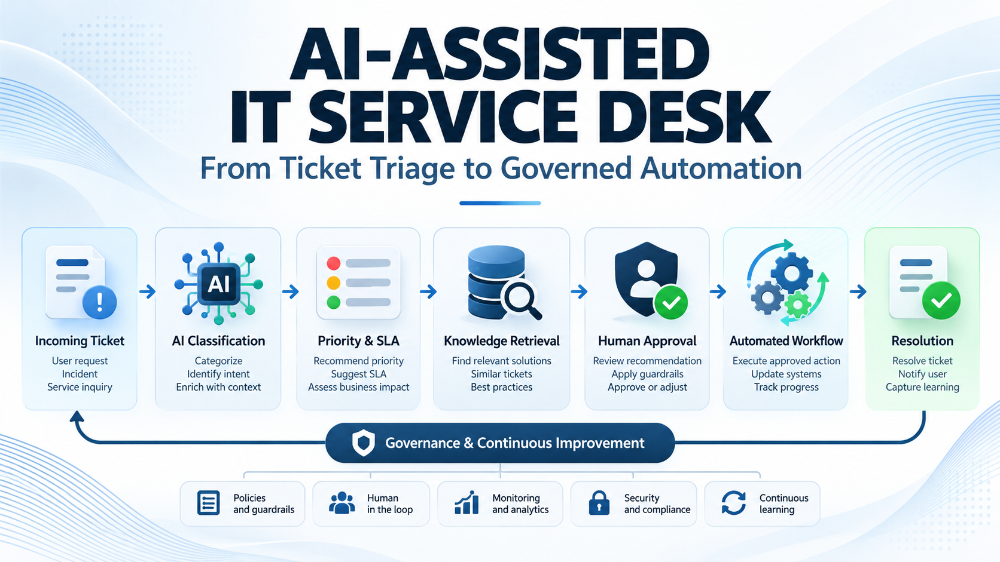

# AI-Assisted IT Service Desk



> **Project visual — AI-assisted ticket triage, governed automation and human oversight.**

> Professional proof of concept | ITSM | AI Assistance | Governed Automation | Service Delivery

A synthetic IT Service Desk proof of concept demonstrating how AI-assisted workflows can support ticket classification, priority and SLA recommendations, knowledge retrieval, human approval, and controlled automation.

**Author:** Shahid Al Parvez Malik  
**Positioning:** Senior IT Infrastructure & Service Delivery Manager | IT Operations | ITSM | Automation | AI

> **Important:** This repository is a portfolio demonstration. It does not claim autonomous production deployment. All ticket data is synthetic and contains no confidential employer or customer information.

## Why This Project?

Traditional service-desk workflows often require analysts to manually read, classify, prioritize, route, investigate, and update tickets.

An AI-assisted workflow can reduce repetitive cognitive and administrative work:

**Ticket → Classification → Context → Priority/SLA → Knowledge → Human Approval → Governed Automation → Resolution → Audit & Analytics**

The key principle is:

> **AI assists with decisions and repetitive work; governance determines what AI is allowed to do.**

## Capabilities

- Ticket category and subcategory recommendation
- Priority recommendation using impact and urgency
- SLA target recommendation
- Assignment-group recommendation
- Knowledge-article suggestion
- Confidence scoring
- Human approval gate
- Automation eligibility rules
- Audit-friendly workflow decisions
- Operational KPI calculation
- Reproducible synthetic data generation

## Example

### Input

> "Finance users cannot access the shared folder after a permissions change."

### AI-assisted recommendation

| Decision | Recommendation |
|---|---|
| Category | Access Management |
| Priority | P2 |
| Assignment | Infrastructure / IAM |
| SLA Target | 8 hours |
| Suggested Knowledge | KB-ACCESS-004 |
| Confidence | High |
| Automation | Not eligible until approval |

The system can recommend the next step without automatically granting privileged access.

## Architecture

```text
                    ┌──────────────────────┐
                    │     Incoming Ticket  │
                    └──────────┬───────────┘
                               ↓
                    ┌──────────────────────┐
                    │ AI Classification    │
                    │ category / service   │
                    └──────────┬───────────┘
                               ↓
                    ┌──────────────────────┐
                    │ Priority + SLA       │
                    │ impact / urgency     │
                    └──────────┬───────────┘
                               ↓
                    ┌──────────────────────┐
                    │ Knowledge Retrieval  │
                    │ approved articles    │
                    └──────────┬───────────┘
                               ↓
                    ┌──────────────────────┐
                    │ Policy & Risk Check  │
                    └──────────┬───────────┘
                               ↓
                 ┌─────────────┴─────────────┐
                 ↓                           ↓
       ┌──────────────────┐        ┌──────────────────┐
       │ Human Approval   │        │ Safe Auto Action │
       │ required         │        │ low-risk only    │
       └────────┬─────────┘        └────────┬─────────┘
                └─────────────┬─────────────┘
                              ↓
                    ┌──────────────────────┐
                    │ Verification / Audit │
                    └──────────┬───────────┘
                               ↓
                    ┌──────────────────────┐
                    │ ITSM Update + KPI    │
                    └──────────────────────┘
```

## Governance Principles

1. AI recommendations are not automatically authoritative.
2. Privileged, destructive, security-sensitive, or production-impacting actions require stronger controls.
3. Low-confidence recommendations are escalated.
4. Automated actions are limited to explicitly approved playbooks.
5. Every automated action is recorded for auditability.
6. Human override remains available.
7. Automation quality is measured by operational outcomes, not task volume.

## Repository Structure

```text
it-service-desk-automation/
├── README.md
├── LICENSE
├── .gitignore
├── requirements.txt
├── data/
│   ├── tickets.csv
│   └── README.md
├── docs/
│   ├── ARCHITECTURE.md
│   ├── GOVERNANCE.md
│   ├── KPI_DEFINITIONS.md
│   ├── DATA_DICTIONARY.md
│   └── LINKEDIN_ARTICLE.md
├── src/
│   ├── classifier.py
│   ├── priority_engine.py
│   ├── sla_engine.py
│   └── workflow.py
├── scripts/
│   └── generate_tickets.py
├── examples/
│   └── run_demo.py
└── tests/
    └── test_workflow.py
```

## LinkedIn Article

The companion thought-leadership article is maintained in the repository for publication and future updates:

[AI-Assisted IT Service Desk: From Ticket Triage to Governed Automation](docs/LINKEDIN_ARTICLE.md)

## Getting Started

This proof of concept uses Python's standard library and does not require paid AI APIs.

```bash
python scripts/generate_tickets.py
python examples/run_demo.py
python -m unittest discover -s tests -p "test_*.py"
```

The baseline implementation uses transparent rules so the decision path can be inspected and tested.

## Operational KPIs

Recommended measures include:

- Recommendation accuracy
- Confidence distribution
- Human override rate
- Automation success rate
- SLA compliance
- Mean Time to Resolve (MTTR)
- First Contact Resolution
- Reopen rate
- Escalation rate
- User satisfaction

A mature implementation should optimize for **service outcomes**, not the number of AI actions.

## Validation

The repository includes unit tests and a GitHub Actions workflow that runs the demo and test suite on pushes and pull requests.

## Future Enhancements

- Replace keyword classification with an NLP model
- Add retrieval over an approved knowledge base
- Add LLM-assisted ticket summarization
- Add policy-as-code controls
- Add workflow/API simulation
- Add Power BI operational dashboard
- Add recommendation evaluation set
- Add model monitoring and drift checks
- Add role-based access and approval simulation

## Professional Relevance

This project demonstrates the management concept:

**ITSM → AI Assistance → Governed Automation → Verified Outcomes → Continuous Improvement**

It is intended to show how an IT Operations leader can translate AI capabilities into a controlled service-management workflow.
